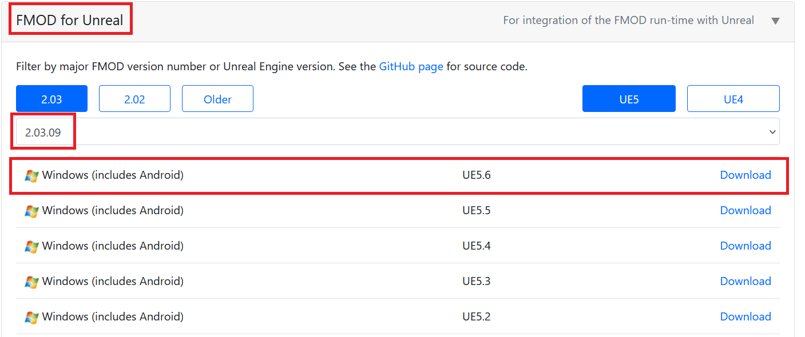
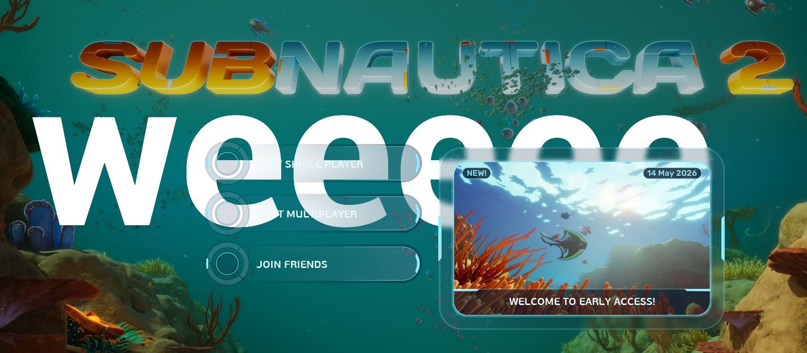
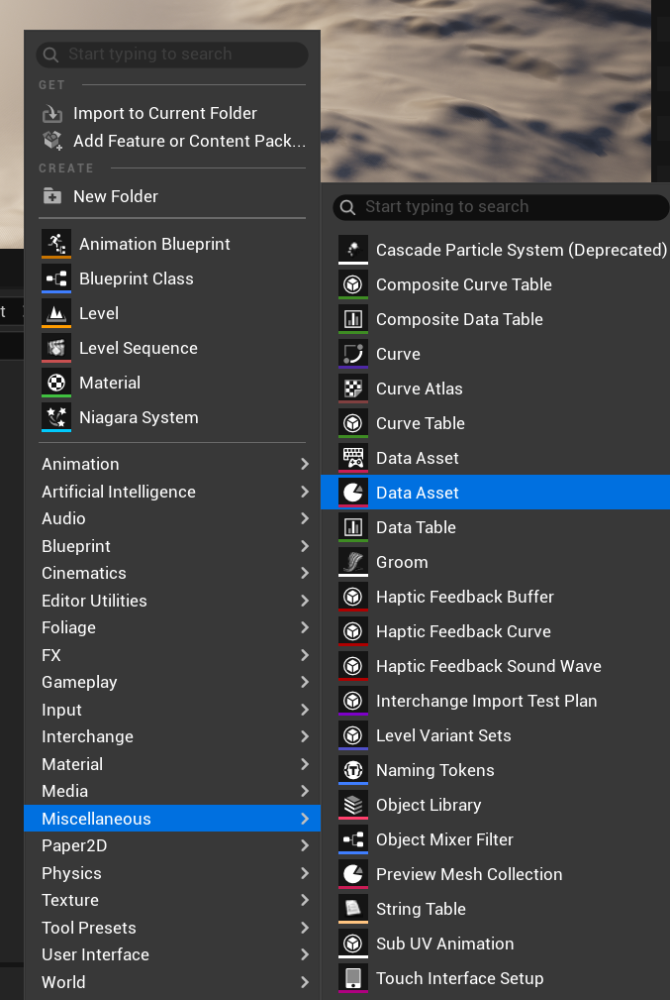
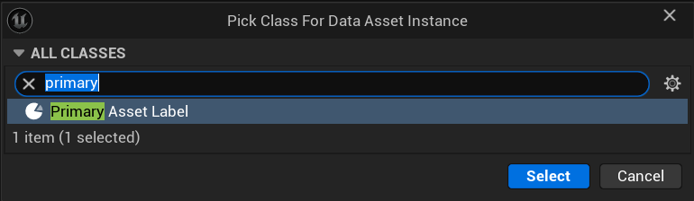
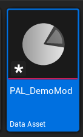
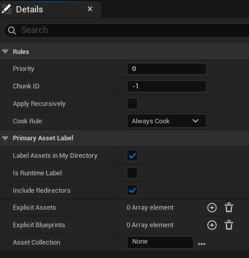
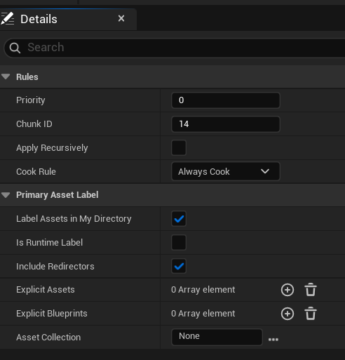
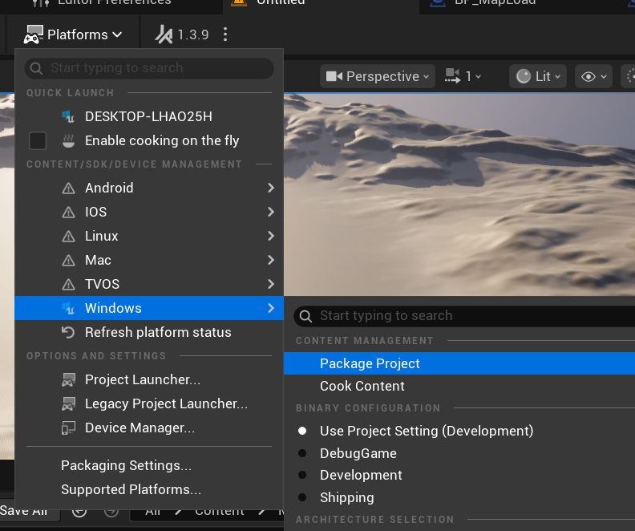
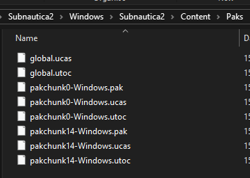

# Subnautica 2 Project

A template UE 5.6 project for creating SN2 mods.

## If you are brand new to modding

Please get familiar with the basics of modding with this excellent set of guides:

https://github.com/Dmgvol/UE_Modding/

Also start with a basic mod idea, such as changing a data asset value (e.g. those that start with `DA_` in `Content/Data`)

## Tools

Get started with [basic mod tooling](./Docs/Tools.md) as outlined in the above UE Modding guides.

## Prerequisites

If you haven't already, install Unreal Engine 5.6.1.

You also need to install Visual Studio 2022 and select the MSVC `v14.38` toolchain to be able to open the project.

[Helpful guide](https://dev.epicgames.com/documentation/unreal-engine/setting-up-visual-studio-development-environment-for-cplusplus-projects-in-unreal-engine?application_version=5.6)

[Reddit post in case you get stuck](https://www.reddit.com/r/unrealengine/comments/1i0bopv/detected_compiler_newer_than_visual_studio_2022/)

## Setting up and opening the project

1. [Clone](https://docs.github.com/en/desktop/contributing-and-collaborating-using-github-desktop/adding-and-cloning-repositories/cloning-and-forking-repositories-from-github-desktop), fork, or download the repository as `.zip`.
2. Download FMOD for Unreal from https://www.fmod.com/download (you have to sign up first)



3. Run this command to copy banks and extract native DLLs 
```ps1
powershell -ExecutionPolicy Bypass -File setup-fmod.ps1 -FMODPluginZip "<downloads>\fmodstudio20309ue5.6win64.zip"
``` 

4. Open `Subnautica2.uproject`. It may spend some time compiling first (2-10 mins depending on your hardware)

This setup must be done for legal reasons:
- Raw FMOD bank files are not included (Unknown Worlds copyright). Copy from your local SN2 install via `setup-fmod.ps1`.
- Native FMOD DLLs are not included (Firelight copyright). Extract from the official FMOD download via `setup-fmod.ps1`.

**(Optional):** If you want to generate a `.sln` file to build the project from its source, right click the `Subnautica2.uproject` file and click `Generate Visual Studio project files` (requires the correct build tools, there are plenty of docs online on how to build UE projects).

## Making your first mod

Follow the guide on setting up a simple blueprint mod with UE4SS: https://docs.ue4ss.com/dev/feature-overview/blueprint-modloader.html

So, you should have a blueprint actor called `ModActor` in `Content/Mods/<yourmodname>/`.

This project contains `DemoMod` to start with which you can use to follow along with this guide and check that everything is setup correctly. You should see this when you enter the main menu:



## Packaging your mod

In this project, we use pak chunks to package your mod files into `.pak` + `.ucas` + `.utoc` mods.

In your mod folder, right click and select **Miscellaneous > Data Asset**:



Now search for and select `Primary Asset Label`.



To follow standard UE naming conventions, call it `PAL_yourmodname` e.g. `PAL_DemoMod`.



Open the asset, set `Cook Rule` to `Always Cook`, and check `Label Assets in My Directory`, like so.



Enter a number between `1` and `300` in this chunk Id field and press Ok. **Do not enter 0 for the Id!**

> [!IMPORTANT]
> Each mod **must** use a seperate pak chunk number to get packaged seperately from each other! Take note of each pak chunk Id you are assigning to files in each mod.



This PAL is a good pal, because it will automatically assign all files in your mod folder with the chunk Id you set for it. It does not get packaged into the game (unless you explicitly tell it to), as it's just a tool for the editor.

Now do `Ctrl` + `S` to save.

Simply click on to `Platforms` -> `Windows` -> `Package Project`:



Now select the output folder location. It doesn't matter much where you put it, so I always just put it into the template project folder. It will create a `Windows` folder. You don't need to delete this folder between packages.

The first time you package it might take a while, as it will likely need to compile some shaders.

Once it is done, you will hear a noise and it will say Packaging complete.

Now navigate to the `Windows/Subnautica2/Content/Paks` folder, you should see all pakchunk files here. There will always be a `pakchunk0` which contains all other packaged editor assets, and it is quite large, so this is why you mustn't set your chunkId to 0.



## Installing the packaged mod

First copy the pakchunk id files, for the number you entered for your mod files. E.g. you set your id to 14, so copy `pakchunk14-Windows.pak`, `pakchunk14-Windows.utoc` & `pakchunk14-Windows.ucas`. 

Navigate to `<steam install>\Subnautica2\Subnautica2\Content\Paks\LogicMods\` and create a folder for your mod (if `LogicMods` folder is not there yet, make it). It should have the same name as the mod folder in the unreal engine project.

Now paste your pakchunk files into the mod folder.

Rename the pakchunk files to the same name as the mod folder in the project, keeping their extensions.

> [!IMPORTANT]
> The files must be the same name as the mod folder in the unreal engine project! If you change the mod folder name in the project later, make sure the update the file names to match it! E.g. if the mod folder in the project is `MyMod`, the files must be called `MyMod.pak`, `MyMod.ucas`, `MyMod.utoc`.

## Automating the installation

The above steps are too manual, so let's make a windows `.bat` script to automate the above (ish - an editor plugin to automate packaging and install of mod will be made eventually so you can do it all from inside the editor). Obviously feel free to automate it your own way, this is just a way you can do it.

Let's say your mod is `pakchunk-14` and your mod name is `DemoMod`. 

Replace `%steaminstalldir%` and `%pathtoyourtemplateproject%` with the your full paths.

```bat
@echo off
mkdir "%steaminstalldir%\Subnautica2\Subnautica2\Content\Paks\LogicMods\DemoMod" 2>nul

copy /Y "%pathtoyourtemplateproject%\Subnautica2\Windows\Subnautica2\Content\Paks\pakchunk14-Windows.pak" "%steaminstalldir%\Subnautica2\Subnautica2\Content\Paks\LogicMods\DemoMod\DemoMod.pak"
copy /Y "%pathtoyourtemplateproject%\Projects\Subnautica2\Windows\Subnautica2\Content\Paks\pakchunk14-Windows.ucas" "%steaminstalldir%\Subnautica2\Subnautica2\Content\Paks\LogicMods\DemoMod\DemoMod.ucas"
copy /Y "%pathtoyourtemplateproject%\Projects\Subnautica2\Windows\Subnautica2\Content\Paks\pakchunk14-Windows.utoc" "%steaminstalldir%\Subnautica2\Subnautica2\Content\Paks\LogicMods\DemoMod\DemoMod.utoc"


echo Copy completed.
start "" "steam://rungameid/1962700"
```

To explain:
1. It makes the directory if it doesn't exist yet
2. It copies the pakchunk files to the mods folder while simultaneously renaming it to the mod name
3. It loads the game from steam (if you don't have the game on steam remove this part)

You can add as many as you like here, though if you don't want to run the game with certain mods, you might want to comment out those lines temporarily.

So when packaging the mod is done, I run the bat and the game launches with all the mod paks installed!
